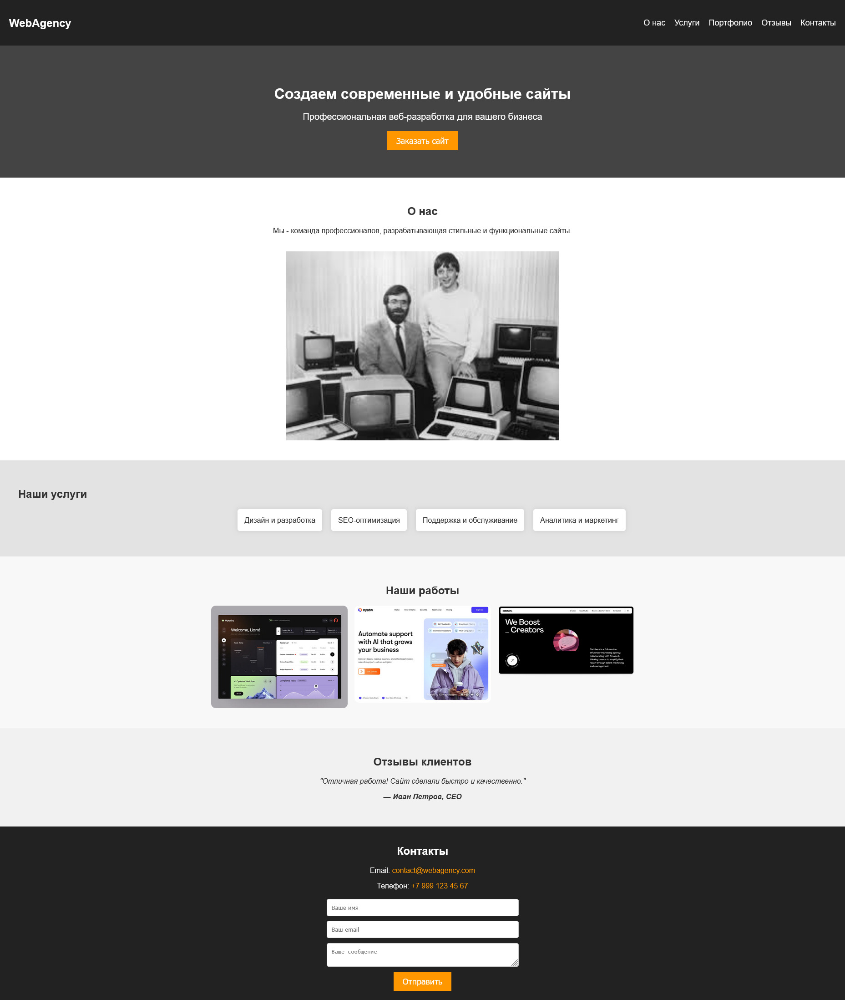

# Задание: Добавление атрибутов HTML тэгам

Правильно расставить атрибуты id и class в HTML-коде, чтобы стили из styles.css корректно применились к элементам страницы.

_Референсом сайта выступает скриншот ниже_



## Теория

### Глобальные атрибуты в HTML: class и id

#### 1. Что такое id и class?

В HTML атрибуты id и class используются для идентификации и стилизации элементов:

- <code>id</code> — уникальный идентификатор элемента на странице. Один id может принадлежать только одному элементу.
- <code>class</code> — группа классов, которая может применяться к нескольким элементам.

    Эти атрибуты позволяют связывать HTML с CSS и JavaScript для стилизации и управления поведением элементов.

#### 2. Различия между id и class

| Атрибут | Уникальность                           | Использование в CSS |
| ------- | -------------------------------------- | ------------------- |
| id      | Уникальный (1 элемент)                 | #id { ... }         |
| class   | Можно применять к нескольким элементам | .class { ... }      |

Когда использовать id?

    Когда элемент встречается только один раз на странице (например, #header, #footer).
    Когда нужно однозначно ссылаться на элемент в ссылке.

Когда использовать class?

    Когда один и тот же стиль нужно применить к нескольким элементам.
    Когда элементы логически принадлежат одной группе (.button, .card, .section).

#### 3. Примеры использования в CSS

_Пример id для уникального элемента:_

```html
<h1 id="main-title">Главный заголовок</h1>
```

```css
#main-title {
    color: blue;
    text-align: center;
}
```

_Пример class для стилизации нескольких элементов:_

```html
<p class="text">Первый абзац</p>
<p class="text">Второй абзац</p>
```

```css
.text {
    font-size: 18px;
    color: gray;
}
```

_Комбинированное использование:_

```html
<div id="header" class="container">Заголовок</div>
```

```css
#header {
    background: black;
    color: white;
}

.container {
    padding: 20px;
    text-align: center;
}
```

### Основные CSS свойства

Базовые стили

    font-family – устанавливает шрифт текста.
    margin – внешний отступ вокруг элемента.
    padding – внутренний отступ внутри элемента.
    color – задает цвет текста.
    background-color – устанавливает фоновый цвет элемента.

Текст и заголовки

    font-size – задает размер шрифта.
    font-weight – регулирует толщину шрифта (например, bold).
    text-align – выравнивает текст (left, center, right).
    text-decoration – оформление текста (например, none убирает подчеркивание у ссылок).

Блоки и контейнеры

    display – определяет тип отображения элемента (block, flex, grid).
    width – задает ширину элемента.
    max-width – ограничивает максимальную ширину.
    height – задает высоту элемента.
    border – устанавливает границу (толщина, стиль, цвет).
    border-radius – закругляет углы элемента.
    box-shadow – добавляет тень элементу.

Навигация и кнопки

    list-style – убирает маркеры у списка (none).
    cursor – изменяет вид курсора (pointer для кнопок).
    transition – добавляет плавные изменения свойств.
    hover – задает стиль при наведении (:hover).

Гибкая верстка

    flex – задает гибкое расположение элементов.
    grid – позволяет создать сетку элементов.
    gap – определяет расстояние между элементами в grid и flex.
    justify-content – выравнивает элементы по горизонтали (center, space-between).
    align-items – выравнивает элементы по вертикали.

Фон и изображения

    background – устанавливает фон (цвет, изображение).
    background-size – определяет размер фонового изображения (cover, contain).
    background-position – задает расположение фонового изображения.

Форма и ввод данных

    input – стилизует поля ввода.
    textarea – задает стили для текстовой области.
    border – изменяет границу полей формы.
    outline – управляет выделением элемента при фокусе (none убирает).

Анимации и эффекты

    opacity – изменяет прозрачность элемента.
    transform – изменяет положение, масштаб, поворот элемента.
    transition – задает плавные изменения свойств.

## Как сдавать

1. Создайте форк репозитория в организации `31ISP` с названием `uidev-lab2-вашафамилия`
2. Используя ветку `wip` оформите HTML документ `index.html`
3. Зафиксируйте изменения в вашем репозитории
4. Когда документ будет готов - создайте пул реквест из ветки `wip` (вашей) на ветку `main` (тоже вашу) и укажите меня ([ktkv419](https://github.com/ktkv419)) как reviewer

**Не мержите сами коммит**, это сделаю я после проверки задания
